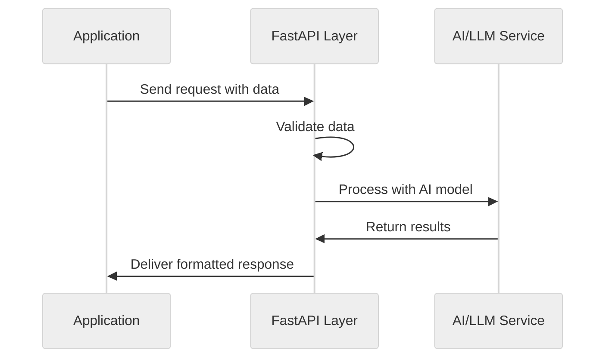

# FastAPI for AI Applications

## What is FastAPI?

[FastAPI](https://fastapi.tiangolo.com/) is a modern, high-performance web framework for building APIs with Python. For AI apps, it serves as the interface between your AI models and the outside world, allowing external systems to send data to your models and receive predictions or processing results. What makes FastAPI particularly appealing is its simplicity and elegance - it provides everything you need without unnecessary complexity.



### Why FastAPI for AI Engineering?

1. **Performance**: Built on Starlette and Pydantic, FastAPI is fast and just works.
2. **Automatic Documentation**: FastAPI automatically generates interactive API documentation (via Swagger UI and ReDoc) from your code and type annotations, making it easier for teams to collaborate.
3. **Type Safety**: Leveraging Pydantic, FastAPI provides automatic request validation and clear error messages, reducing the likelihood of runtime errors.
4. **Asynchronous Support**: Native support for async/await patterns allows your API to handle multiple requests efficiently while waiting for AI model responses.
5. **WebSocket Support**: For streaming AI responses or building real-time applications, FastAPI provides first-class WebSocket support.

## Learn More

Beyond this README, [this tutorial](https://fastapi.tiangolo.com/tutorial/) shows you how to use FastAPI with most of its features, step by step. 

## Quick Start

1. Clone repository
    ```bash
   git clone https://github.com/daveebbelaar/fastapi-tutorial.git
   ```

2. Install dependencies:
   ```bash
   uv sync
   ```

3. Run the application:
   ```bash
   cd app
   uvicorn main:app --reload
   ```

3. Access your API:
   - API endpoints: http://localhost:8000/events
   - Interactive docs: http://localhost:8000/docs

### About Uvicorn

Uvicorn is an ASGI server that actually runs your FastAPI application. While FastAPI defines your API structure and logic, Uvicorn is the server that handles HTTP connections and serves your application. 

Think of FastAPI as the blueprint for your API, and Uvicorn as the engine that powers it.

The command `uvicorn main:app --reload` means:
- `main`: Use the file named `main.py`
- `:app`: Look for a variable named `app` within that file
- `--reload`: Automatically restart the server when you change your code (useful during development)

### Default Port

By default, Uvicorn runs on port 8000. This means:
- Your API will be accessible at `http://localhost:8000`
- `localhost` refers to your own computer
- `8000` is the "door" or port number through which requests can access your API

You can change this with the `--port` flag if needed:
```bash
uvicorn main:app --port 5000
```

## Structure

- `main.py`: Application entry point that creates the FastAPI app
- `router.py`: Routes incoming requests to the appropriate endpoint handlers
- `endpoint.py`: Defines data models and endpoint logic for processing events

This modular approach keeps your code organized as your AI application grows in complexity.

> For comprehensive documentation, visit the [FastAPI official docs](https://fastapi.tiangolo.com/).

## Code Walkthrough

Let's examine how our three files work together to create a clean API for processing AI events.

### 1. `main.py` - Application Entry Point

```python
from fastapi import FastAPI
from router import router as process_router

app = FastAPI()
app.include_router(process_router)
```

This file:

- Creates the main FastAPI application instance
- Imports and includes our router
- Serves as the entry point for Uvicorn to run our application

### 2. `router.py` - Request Routing

```python
from fastapi import APIRouter
import endpoint

router = APIRouter()
router.include_router(endpoint.router, prefix="/events", tags=["events"])
```

This file:

- Creates a main router
- Imports our endpoint module with its router
- Adds the endpoint router with the prefix `/events`
- Uses tags for documentation organization
- Routes all requests that start with `/events` to our endpoint

### 3. `endpoint.py` - Core Logic

```python
import json
from http import HTTPStatus

from fastapi import APIRouter
from pydantic import BaseModel
from starlette.responses import Response

router = APIRouter()


class EventSchema(BaseModel):
    """Event Schema"""

    event_id: str
    event_type: str
    event_data: dict


@router.post("/", dependencies=[])
def handle_event(
    data: EventSchema,
) -> Response:
    print(data)

    # Return acceptance response
    return Response(
        content=json.dumps({"message": "Data received!"}),
        status_code=HTTPStatus.ACCEPTED,
    )
```

This file:

- Defines a Pydantic model `EventSchema` that validates incoming data
- Creates an endpoint router
- Defines a POST handler at `/` (which becomes `/events/` when mounted in router.py)
- Accepts and validates incoming data against our schema
- Returns a JSON response with HTTP status code 202 (Accepted)

#### Key Components:

1. **Pydantic Model**: `EventSchema` defines the structure of valid incoming data:
   - `event_id`: A unique identifier for the event
   - `event_type`: The category or type of event
   - `event_data`: A dictionary containing the actual event data

2. **Router Decorator**: `@router.post("/")` creates a POST endpoint at the base path

3. **Request Handler**: `handle_event()` processes incoming data:
   - FastAPI automatically validates incoming JSON against `EventSchema`
   - Invalid data will be rejected with appropriate error messages
   - Valid data is passed to our function where we can process it

4. **Response**: Returns a simple JSON confirmation with status code 202 (Accepted)

## Sync vs. Async Endpoints in FastAPI

FastAPI supports both synchronous and asynchronous request handlers.

### Synchronous Endpoints

Synchronous endpoints use standard Python functions and block the server while processing:

```python
@router.post("/sync")
def sync_endpoint(data: EventSchema):
    # This blocks the server until completion
    result = process_data(data)
    return {"result": result}
```

**When to use:** For quick operations that complete rapidly (under 1 second)

### Asynchronous Endpoints

Asynchronous endpoints use Python's `async`/`await` syntax and don't block the server:

```python
@router.post("/async")
async def async_endpoint(data: EventSchema):
    # This doesn't block the server
    result = await async_process_data(data)
    return {"result": result}
```

**When to use:** For operations that:

- Involve I/O operations (API calls, database queries)
- Take longer to process (complex AI inference)
- Need to handle many concurrent requests

### Key Points

- FastAPI is designed for async and performs best with async handlers
- You can mix sync and async endpoints in the same application
- For AI applications with external API calls or long processing, async is strongly recommended
- With sync functions, you need more workers to handle the same number of concurrent requests

## Testing Your Endpoint

To quickly test your FastAPI endpoint, you can use the `requests.py` file

### What This Script Does

1. Sets up the endpoint URL where your FastAPI server is running
2. Creates a sample event with:
   - A random UUID as the event ID
   - A test event type
   - A dictionary of sample event data
3. Sends a POST request to your endpoint
4. Prints the response status code and body

## Understanding API Methods: GET vs POST

If you're new to APIs, think of the difference between GET and POST as similar to the difference between reading and writing.

### GET: Asking for Information

A GET request is like asking someone a question. When you use GET in an API, you're simply requesting information without changing anything. 

For example, checking the weather on a website is a GET request - you're just asking "What's the weather today?" without changing the weather itself.

In FastAPI, you'd use GET when you want to retrieve information:

```python
@router.get("/status")
def get_status():
    return {"status": "online"}
```

This creates an endpoint that tells users about your API's status when they visit `/status`.

### POST: Sending Information to Process

A POST request is like filling out and submitting a form. When you use POST, you're sending data that needs to be processed or stored.

Imagine ordering food through a delivery app. You're not just asking a question; you're submitting information (your order) that will change something on the server (create a new order in their system).

In FastAPI, you'd use POST when receiving data for your AI to process:

```python
@router.post("/analyze")
def analyze_text(data: TextSchema):
    # Process the text with your AI model
    return {"sentiment": "positive"}
```

This creates an endpoint that accepts text data, processes it, and returns an analysis.

### When to Use Each in AI Applications

For your AI applications, use GET when users are retrieving information without changing state - like checking if a model is available or retrieving previously generated results.

Use POST when users are sending data that your AI needs to process - like text for summarization, images for classification, or parameters for generation.

## Securing Your FastAPI Endpoint with Bearer Tokens

Bearer token authentication is the recommended approach for modern APIs, including AI applications. It's more standardized and flexible than simple API keys.

### Implementing Bearer Token Authentication

```python
from fastapi import APIRouter, Depends, HTTPException
from fastapi.security import HTTPBearer, HTTPAuthorizationCredentials

router = APIRouter()

# Create security scheme
security = HTTPBearer()

# In production, store this in environment variables
API_TOKEN = "your-secret-token"

@router.post("/")
def handle_event(
    data: EventSchema,
    credentials: HTTPAuthorizationCredentials = Depends(security)
):
    # Validate the token
    if credentials.credentials != API_TOKEN:
        raise HTTPException(
            status_code=401, 
            detail="Invalid authentication token"
        )
    
    # Process the valid request
    return {"message": "Data received!"}
```

### Sending Authenticated Requests

```python
import requests
import json

# API endpoint
url = "http://localhost:8000/events/"

# Sample event data
event_data = {
    "event_id": "123e4567-e89b-12d3-a456-426614174000",
    "event_type": "test_event",
    "event_data": {"message": "Hello AI world!"}
}

# Send POST request with Bearer token
headers = {
    "Content-Type": "application/json",
    "Authorization": "Bearer your-secret-token"
}

response = requests.post(
    url=url,
    data=json.dumps(event_data),
    headers=headers
)
```

### Why Bearer Tokens?

Bearer tokens have become the standard for API authentication because they:

1. Follow OAuth 2.0 specifications used by major APIs worldwide
2. Can be easily extended to JWT (JSON Web Tokens) for more advanced use cases
3. Are supported by all API clients and languages
4. Work well with token management systems

For production applications, consider using JWT tokens which allow you to include expiration times and additional claims in the token itself.

For more advanced authentication options, refer to the [FastAPI Security documentation](https://fastapi.tiangolo.com/tutorial/security/).


Docker build
```
docker build -t fastapi-test .
```

Docker run
```
docker run -p 8000:8000 fastapi-test
```